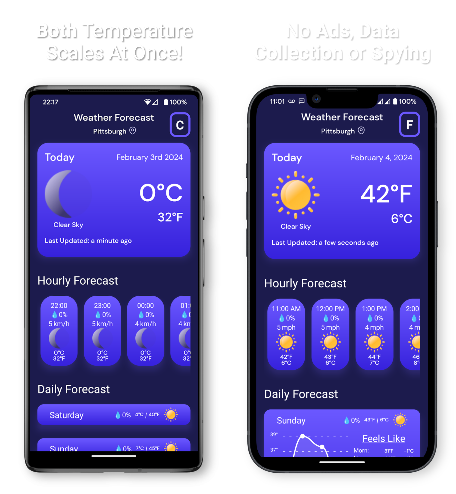

<!-- PROJECT SHIELDS -->
<!--
*** I'm using markdown "reference style" links for readability.
*** Reference links are enclosed in brackets [ ] instead of parentheses ( ).
*** See the bottom of this document for the declaration of the reference variables
*** for contributors-url, forks-url, etc. This is an optional, concise syntax you may use.
*** https://www.markdownguide.org/basic-syntax/#reference-style-links
-->
[![Contributors][contributors-shield]][contributors-url]
[![Forks][forks-shield]][forks-url]
[![Stargazers][stars-shield]][stars-url]
[![Issues][issues-shield]][issues-url]
[![MIT License][license-shield]][license-url]


<!-- PROJECT LOGO -->
<br />
<p align="center">
  <a href="https://github.com/eladkarni/rn-dualtemp-weather">
    
  </a>

  <h3 align="center">React-Native DualTemp Weather</h3>

  <p align="center">
    <br />
    <a href="https://github.com/eladkarni/rn-dualtemp-weather"><strong>Explore the docs »</strong></a>
    <br />
    <br />
    <a href="https://dualtemp-weather.netlify.app/">View Demo</a>
    ·
    <a href="https://github.com/eladkarni/rn-dualtemp-weather/issues">Report Bug</a>
    ·
    <a href="https://github.com/eladkarni/rn-dualtemp-weather/issues">Request Feature</a>
  </p>
  <h3 align="center">Now available on the Google Play Store & Apple App Store!</h3>
  <p align="center">
    <a href="https://apps.apple.com/app/id1665040449?platform=iphone">
      
    </a>
    <a href="https://play.google.com/store/apps/details?id=com.ekarni.rndualtempweatherapp&hl=en_US&gl=US">
      
    </a>
  </p>
</a>
</p>

<p align="center">
  
</p>

<!-- TABLE OF CONTENTS -->
<details open="open">
  <summary><h2 style="display: inline-block">Table of Contents</h2></summary>
  <ol>
    <li>
      <a href="#about-the-project">About The Project</a>
      <ul>
        <li><a href="#built-with">Built With</a></li>
      </ul>
    </li>
    <li>
      <a href="#getting-started">Getting Started</a>
      <ul>
        <li><a href="#prerequisites">Prerequisites</a></li>
        <li><a href="#installation">Installation</a></li>
      </ul>
    </li>
    <li><a href="#usage">Usage</a></li>
    <li><a href="#roadmap">Roadmap</a></li>
    <li><a href="#contributing">Contributing</a></li>
    <li><a href="#license">License</a></li>
    <li><a href="#contact">Contact</a></li>
    <li><a href="#acknowledgements">Acknowledgements</a></li>
  </ol>
</details>


### Built With

* [Expo](https://expo.dev/)
* [EAS](https://expo.dev/eas)
* [React-Native](https://reactnative.dev/)
* [Typescript](https://www.typescriptlang.org/)
* [Open Weather](https://openweathermap.org/)


<!-- GETTING STARTED -->
## Getting Started

To get a local copy up and running follow these simple steps.

### Prerequisites

Before getting started, you'll need to setup your enviorment.

1. Install a Package Manager (`npm` or `yarn`)
* 
  ```sh
  npm install -g npm
  ```

2. Install Expo CLI
* 
  ```sh
  npm install --global expo-cli
  ```

3. [OPTIONAL] To publish or build with `Expo Application Services (EAS)`, you'll need to also install the `eas-cli`:
*
  ```sh
  npm install -g eas-cli
  ```
<br />

### Installation

1. Clone the repo
   ```sh
   git clone https://github.com/eladkarni/rn-dualtemp-weather.git
   ```
2. Install packages
   ```sh
   npm install
   ``` 

<br>

<!-- USAGE EXAMPLES -->
## Usage

If you have all of the dependencies installs, then you are ready to get started!

### <u>Required API Keys</u>
You'll also need to make sure you have the required API keys to run the app. One will be for the weather data and another will be for the reverse geolocation (converting a GPS coordinates to a city or county).

The first key you'll need is from [Open Weather](https://openweathermap.org/)
<br/>
The second key you'll need is for the reverse geolocation [Geoapify](https://www.geoapify.com/)


Once you have both keys, you'll need to dupliacte the `app.config.template.js` and rename the copy to `app.config.js`. Then add the API keys in the empty `""`

### <u>Running The App</u>
To start the project, use the following command:
```sh
  npm start
```
This will start the development server and provide you additional options for testing devices. 

Once you are done done testing on your Simulator or using the Expo Go app, you can build the app the following command:

```sh
  eas build --profile development --platform android
```
Note that `development` is one of the predefined build presets. To see the other options or add your own, checkout `eas.json` in the root directory. You'll also need to remove `app.config.js` from the `.gitignore` as EAS uses that to determain what to upload for processing.

<br>
<br>

<!-- ROADMAP -->
## Roadmap

See the [open issues](https://github.com/eladkarni/rn-dualtemp-weather/issues) for a list of proposed features (and known issues).


<!-- CONTRIBUTING -->
## Contributing

Contributions are what make the open source community such an amazing place to learn, inspire, and create. Any contributions you make are **greatly appreciated**.

1. Fork the Project
2. Create your Feature Branch (`git checkout -b feature/AmazingFeature`)
3. Commit your Changes (`git commit -m 'Add some AmazingFeature'`)
4. Push to the Branch (`git push origin feature/AmazingFeature`)
5. Open a Pull Request


<!-- LICENSE -->
## License

Distributed under the MIT License. See `LICENSE` for more information.


<!-- MARKDOWN LINKS & IMAGES -->
<!-- https://www.markdownguide.org/basic-syntax/#reference-style-links -->
[contributors-shield]: https://img.shields.io/github/contributors/eladkarni/rn-dualtemp-weather.svg?style=for-the-badge
[contributors-url]: https://github.com/EladKarni/rn-dualtemp-weather/graphs/contributors

[forks-shield]: https://img.shields.io/github/forks/EladKarni/rn-dualtemp-weather.svg?style=for-the-badge
[forks-url]: https://github.com/EladKarni/rn-dualtemp-weather/network/members

[stars-shield]: https://img.shields.io/github/stars/EladKarni/rn-dualtemp-weather.svg?style=for-the-badge
[stars-url]: https://github.com/EladKarni/rn-dualtemp-weather/stargazers

[issues-shield]: https://img.shields.io/github/issues/EladKarni/rn-dualtemp-weather.svg?style=for-the-badge
[issues-url]: https://github.com/EladKarni/rn-dualtemp-weather/issues

[license-shield]: https://img.shields.io/github/license/EladKarni/rn-dualtemp-weather.svg?style=for-the-badge
[license-url]: https://github.com/EladKarni/rn-dualtemp-weather/blob/master/LICENSE.txt
