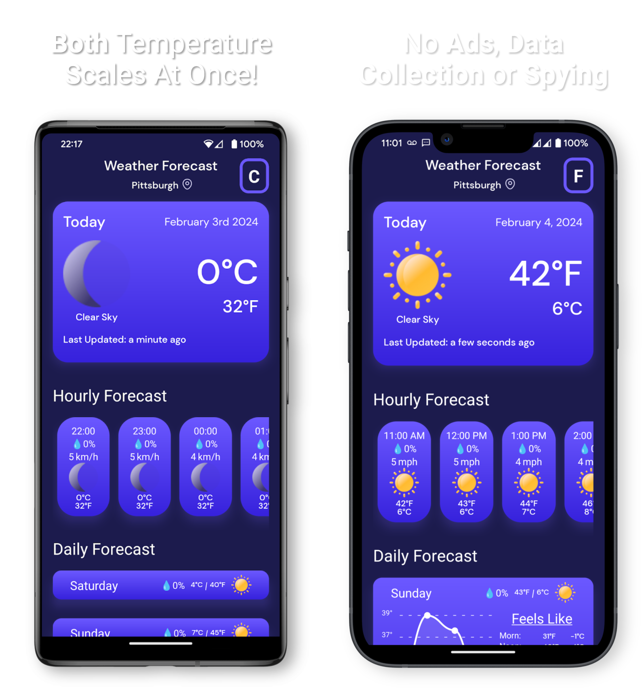

<!-- PROJECT SHIELDS -->
<!--
*** I'm using markdown "reference style" links for readability.
*** Reference links are enclosed in brackets [ ] instead of parentheses ( ).
*** See the bottom of this document for the declaration of the reference variables
*** for contributors-url, forks-url, etc. This is an optional, concise syntax you may use.
*** https://www.markdownguide.org/basic-syntax/#reference-style-links
-->
[![Contributors][contributors-shield]][contributors-url]
[![Forks][forks-shield]][forks-url]
[![Stargazers][stars-shield]][stars-url]
[![Issues][issues-shield]][issues-url]
[![MIT License][license-shield]][license-url]
[![Netlify Status][netlify-shield]][netlify-url]


<!-- PROJECT LOGO -->
<br />
<p align="center">
  <a href="https://github.com/eladkarni/rn-dualtemp-weather">
    
  </a>

  <h3 align="center">React-Native DualTemp Weather</h3>

  <p align="center">
    A cross-platform weather app that shows temperatures in Celsius <em>and</em> Fahrenheit at a glance, with home-screen widgets, offline caching, and support for 6 languages.
    <br />
    <br />
    <a href="https://dualtemp-weather.netlify.app/">View Demo</a>
    ·
    <a href="https://github.com/eladkarni/rn-dualtemp-weather/issues">Report Bug</a>
    ·
    <a href="https://github.com/eladkarni/rn-dualtemp-weather/issues">Request Feature</a>
  </p>
  <h3 align="center">Now available on the Google Play Store & Apple App Store!</h3>
  <p align="center">
    <a href="https://apps.apple.com/app/id1665040449?platform=iphone">
      
    </a>
    <a href="https://play.google.com/store/apps/details?id=com.ekarni.rndualtempweatherapp&hl=en_US&gl=US">
      
    </a>
  </p>
</p>

<p align="center">
  
</p>

<!-- TABLE OF CONTENTS -->
<details open="open">
  <summary><h2 style="display: inline-block">Table of Contents</h2></summary>
  <ol>
    <li><a href="#about-the-project">About The Project</a></li>
    <li><a href="#features">Features</a></li>
    <li><a href="#built-with">Built With</a></li>
    <li>
      <a href="#getting-started">Getting Started</a>
      <ul>
        <li><a href="#prerequisites">Prerequisites</a></li>
        <li><a href="#installation">Installation</a></li>
        <li><a href="#configuration">Configuration</a></li>
        <li><a href="#running-the-app">Running the App</a></li>
      </ul>
    </li>
    <li><a href="#build-variants">Build Variants</a></li>
    <li><a href="#project-structure">Project Structure</a></li>
    <li><a href="#documentation">Documentation</a></li>
    <li><a href="#roadmap">Roadmap</a></li>
    <li><a href="#contributing">Contributing</a></li>
    <li><a href="#license">License</a></li>
  </ol>
</details>


## About The Project

DualTemp Weather is a React Native (Expo) app that presents current conditions and
forecasts with **both Celsius and Fahrenheit shown together**, so you never have to
convert in your head. It works offline from a local cache, ships home-screen widgets
on Android and iOS, and is fully localized (including right-to-left layouts).

All network calls — weather forecasts **and** city search — go through a hosted proxy,
so **no API keys are required to run the app locally**. See [Configuration](#configuration).


## Features

- **Dual-temperature display** — current, hourly, and daily temperatures in °C and °F simultaneously.
- **Home-screen widgets on both platforms**
  - Android: three sizes (Compact, Standard, Extended) via `react-native-android-widget`.
  - iOS: widgets via `@bacons/apple-targets`, sharing data through App Groups.
- **Multiple saved locations** — GPS location plus up to **25** saved cities, with background prefetch.
- **6 languages with RTL support** — English, Spanish, French, Chinese, Arabic, and Hebrew (Arabic and Hebrew render right-to-left).
- **Offline-first caching** — forecasts persist to SQLite and the TanStack Query cache persists to AsyncStorage, so the last-known weather is available with no connection.
- **Configurable units & clock** — Celsius/Fahrenheit preference, 12/24-hour clock (or follow the device), and optional sunrise/sunset info.
- **Resilient error handling** — typed error taxonomy with localized, recoverable user messages; privacy-scrubbed crash reporting via Sentry.


## Built With

* [Expo](https://expo.dev/) (SDK 54) + [EAS](https://expo.dev/eas)
* [React Native](https://reactnative.dev/) 0.81 / [React](https://react.dev/) 19
* [TypeScript](https://www.typescriptlang.org/) (strict mode)
* [Zustand](https://github.com/pmndrs/zustand) — state management
* [TanStack Query](https://tanstack.com/query) — data fetching & cache persistence
* [expo-sqlite](https://docs.expo.dev/versions/latest/sdk/sqlite/) — offline weather cache
* [i18n-js](https://github.com/fnando/i18n) + [expo-localization](https://docs.expo.dev/versions/latest/sdk/localization/) — localization
* [react-native-android-widget](https://github.com/sAleksovski/react-native-android-widget) + [@bacons/apple-targets](https://github.com/EvanBacon/expo-apple-targets) — home-screen widgets


<!-- GETTING STARTED -->
## Getting Started

To get a local copy up and running, follow these steps.

### Prerequisites

- [Node.js](https://nodejs.org/) 20+
- [Yarn](https://classic.yarnpkg.com/) 1.x (this repo uses Yarn Classic — see `packageManager` in `package.json`)
- The [Expo CLI](https://docs.expo.dev/more/expo-cli/) is bundled — run it via `npx expo` / the `yarn` scripts; no global install required.
- _(Optional)_ [EAS CLI](https://docs.expo.dev/eas/) for cloud builds: `npm install -g eas-cli`

### Installation

1. Clone the repo
   ```sh
   git clone https://github.com/eladkarni/rn-dualtemp-weather.git
   cd rn-dualtemp-weather
   ```
2. Install dependencies
   ```sh
   yarn install
   ```

### Configuration

Copy the example env file and adjust as needed:

```sh
cp .env.example .env.local
```

**No API keys are required for local development.** The defaults in `.env.example`
point weather **and** city-search requests at a hosted proxy, which holds the
upstream credentials server-side. The variables are:

| Variable | Required | Purpose |
| --- | --- | --- |
| `EXPO_PUBLIC_WEATHER_API_URL` | Yes (pre-filled) | Base URL of the weather/geocoding proxy. Must end with a trailing `/`. |
| `EXPO_PUBLIC_SUPPORT_EMAIL` | No | Contact email surfaced on persistent errors. |
| `EXPO_PUBLIC_SPLASH_TIMEOUT_MS` | No | Max time (ms) to hold the splash screen before showing the UI. |
| `EXPO_PUBLIC_SENTRY_DSN` | No | Sentry DSN for crash reporting. Leave empty to disable. |
| `SENTRY_AUTH_TOKEN` | No | Build-time only, for uploading source maps. **Never** commit it, and never give it the `EXPO_PUBLIC_` prefix. |

`.env.local` is git-ignored — only `.env.example` is tracked.

### Running the App

```sh
yarn start
```

This starts the Expo dev server (with the dev client) and offers options for
launching on a simulator/emulator or a physical device. Other handy scripts:

```sh
yarn android   # build & run on Android
yarn ios       # build & run on iOS
yarn web       # run in the browser
yarn gate      # tsc --noEmit + eslint + jest (the full CI gate)
yarn test      # jest only
yarn lint      # eslint only
```


## Build Variants

This app supports three build variants. On Android all three can be installed
simultaneously on the same device:

#### Production Variant

Used for the `production` build profile.

* **Bundle ID (iOS):** `com.ekarni.rndualtempweatherapp`
* **Package Name (Android):** `com.ekarni.rndualtempweatherapp`
* **App Name:** "Dualtemp Weather"
* **Icon:** Standard app icon

#### Development Variant

Used for the `development` build profile.

* **Bundle ID (iOS):** `com.ekarni.rndualtempweatherapp.dev`
* **Package Name (Android):** `com.ekarni.rndualtempweatherapp.dev`
* **App Name:** "Dualtemp Weather Dev"
* **Icon:** App icon with a "DEV" badge overlay

#### Preview Variant (Android only)

Used for the `preview` build profile. Produces a sideloadable APK that installs
alongside production for on-device comparison. iOS config is deliberately left
untouched — an iOS preview build would come out identical to production.

* **Package Name (Android):** `com.ekarni.rndualtempweatherapp.preview`
* **App Name:** "Dualtemp Weather Preview"
* **Icon:** App icon with a "PREVIEW" badge overlay (regenerate via
  `node scripts/generate-preview-icon.js`)
* **Widgets:** labels prefixed with `[Preview]` so the launcher's widget picker
  stays unambiguous with both variants installed
* **Backend:** `EXPO_PUBLIC_WEATHER_API_URL` is pinned in the `preview` profile
  of `eas.json` — edit that single line to re-point the build at a different
  proxy deployment (note: a value there overrides any variable of the same name
  in the EAS dashboard's "preview" environment). Widget/app data is isolated
  from production automatically because Android scopes AsyncStorage per package.

#### Building Variants

```sh
# Development variant (installable alongside production)
eas build --profile development --platform all

# Preview variant (Android-only side-by-side APK)
eas build --profile preview --platform android

# Production variant (for the app stores)
eas build --profile production --platform all
```

#### Local Prebuild

```sh
yarn prebuild:dev    # prebuild with the development configuration
yarn prebuild:prod   # prebuild with the production configuration
```

`app.config.js` reads the `EAS_BUILD_PROFILE` environment variable and merges the
matching variant overrides on top of `app.json` automatically. There is no
`app.config.template.js` — configuration lives in `app.json` + `app.config.js`,
and secrets/URLs come from environment variables (see [Configuration](#configuration)).


## Project Structure

```
.
├── App.tsx                 # Root component: render-state machine, providers, effects
├── index.js                # Registration glue (registers the root + widget task handler)
├── app.json / app.config.js# Expo config + per-variant overrides
└── src/
    ├── components/         # Reusable UI + colocated <Name>.styles.ts
    ├── config/             # App composition root + TanStack Query client
    ├── contexts/           # React contexts (AppStateContext)
    ├── hooks/              # Data & lifecycle hooks (useMultiLocationWeather, useAppLifecycle, ...)
    ├── localization/       # i18n setup + 6 locale files (en, es, fr, ar, he, zh)
    ├── screens/            # Full-screen views + colocated <Name>.styles.ts
    ├── services/db/        # SQLite weather cache (database.ts / database.web.ts)
    ├── store/              # Zustand stores (forecast, location, language, settings, modal)
    ├── styles/             # Shared design tokens (Palette, Spacing, Typography, BoxShadow)
    ├── types/              # Shared TypeScript types
    ├── utils/              # fetchWeather, errors, httpClient, geocoding, logger, formatters
    └── widgets/            # Home-screen widget components + task handler + updater
```

Tests live in `__tests__/` folders colocated with the code they cover and run with
`jest-expo`. Style-file convention: `<Name>.styles.ts`, colocated with its component/screen.


## Documentation

Design and planning documents live in [`plans/`](./plans):

- [`ios-home-widgets-implementation.md`](./plans/ios-home-widgets-implementation.md) — iOS home-widget implementation plan (with per-phase status).
- [`green-gate-plan.md`](./plans/green-gate-plan.md) — the multi-agent "green gate" remediation plan (CI gate + fixes).
- [`proxy-hardening-spec.md`](./plans/proxy-hardening-spec.md) — spec for hardening the weather/geocoding proxy (rate-limiting, CORS, optional app token).


<!-- ROADMAP -->
## Roadmap

See the [open issues](https://github.com/eladkarni/rn-dualtemp-weather/issues) for a list of proposed features (and known issues).


<!-- CONTRIBUTING -->
## Contributing

Contributions are what make the open source community such an amazing place to learn, inspire, and create. Any contributions you make are **greatly appreciated**.

1. Fork the Project
2. Create your Feature Branch (`git checkout -b feature/AmazingFeature`)
3. Make your changes and ensure the gate is green (`yarn gate`)
4. Commit your Changes (`git commit -m 'Add some AmazingFeature'`)
5. Push to the Branch (`git push origin feature/AmazingFeature`)
6. Open a Pull Request


<!-- LICENSE -->
## License

Distributed under the MIT License. See `LICENSE` for more information.


<!-- MARKDOWN LINKS & IMAGES -->
<!-- https://www.markdownguide.org/basic-syntax/#reference-style-links -->
[contributors-shield]: https://img.shields.io/github/contributors/eladkarni/rn-dualtemp-weather.svg?style=for-the-badge
[contributors-url]: https://github.com/EladKarni/rn-dualtemp-weather/graphs/contributors

[forks-shield]: https://img.shields.io/github/forks/EladKarni/rn-dualtemp-weather.svg?style=for-the-badge
[forks-url]: https://github.com/EladKarni/rn-dualtemp-weather/network/members

[stars-shield]: https://img.shields.io/github/stars/EladKarni/rn-dualtemp-weather.svg?style=for-the-badge
[stars-url]: https://github.com/EladKarni/rn-dualtemp-weather/stargazers

[issues-shield]: https://img.shields.io/github/issues/EladKarni/rn-dualtemp-weather.svg?style=for-the-badge
[issues-url]: https://github.com/EladKarni/rn-dualtemp-weather/issues

[license-shield]: https://img.shields.io/github/license/EladKarni/rn-dualtemp-weather.svg?style=for-the-badge
[license-url]: https://github.com/EladKarni/rn-dualtemp-weather/blob/master/LICENSE.txt

[netlify-shield]: https://img.shields.io/netlify/dab5e8be-4a0f-4957-8dba-4aa99d705e43?style=for-the-badge
[netlify-url]: https://api.netlify.com/api/v1/badges/dab5e8be-4a0f-4957-8dba-4aa99d705e43/deploy-status
